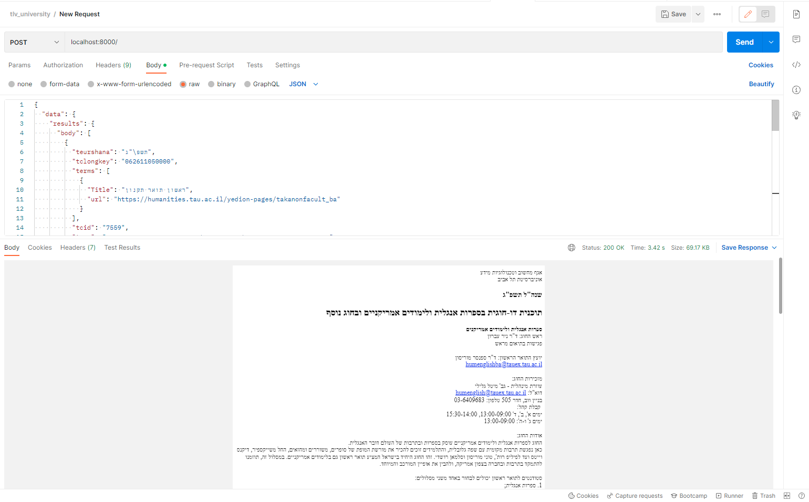

<div dir="auto" align="right">

<span style="color: #177187">

# תיאור התוכנית

</span>

יצירת תוכנית/ (REST API) להפקת קבצי PDF שתוכנם מתעד תוכנית לימודים כפי שהופיע באתר האוניברסיטה .
התוכנית כאמור תהיה מבוססת על שירות שיקבל את הפרמטרים (JSONSׂ ) דרך התחברות לממשק שהאוניברסיטה תספק ויחזיר בחזרה BLOB של קובץ PDF .

התכנית תכיל ENDPOINTS שיקבל REQUEST במתודת POST ותכיל את ההתייחסות לנקודות הבאות:

- פורמט אחיד של קבצי הPDF
- נגישות לפי דרישות התקן הישראלי

</div>
<span style="color: #A54D69">

**סקיצה ראשונית המוצעת לגשת אל הפתרון :**

 </span>

```javascript
let data = {};

let htmlOutput = reactRenderService.generateHtml(data);

let pdf = pdfService.generatePdf(htmlOutput);

MediaRecorder.pdf = pdf;
```

<div dir="auto" align="right">

<span style="color: #177187">

## שלבי התוכנית במבט על :

</span>

1. יצירת ממשק התחברות לAPI כדי למשוך את הדאטה -
   יצירת קובץ api.js שימשוך מידע מהAPI יבצע חיבור וקריאות http request דרך פונקציות שיחזירו את הdata .
2. יצירת קומפוננטת ריאקט reactRenderService שתיצור תבנית/טמפלט ליצירת דפי HTML .תקבל את הקלט data דרך קריאות לפונקציות של ממשק ההתחברות לAPI ותחזיר בחזרה HTML.
   כדי שנוכל לקבל PDF לפי תבנית נדרשת ,יש לפרמט את הdata לתבנית שהתבקשנו לייצר ,וממנה ליצור קובץ PDF בהתאם לסעיף 6 במסמך האפיון
3. יצירת pdfService ליצירת קבצי PDF יקבל כקלט את הHTML ויחזיר חזרה קובץ PDF יש להתייחס לדרישות הנגישות
4. יצירת REST API לטובת יצירת אוטונומיה כך ששימוש בAPI יצפה לקבל JSON בפורמט הספציפי ויחזיר בחזרה BLOB לPDF
5. העלאת הקוד לפרודקשיין - העלאה לרשת וזמינות הAPI

<span style="color: #177187">

## סיבות לבחירה הטכנולוגית :

בחרתי ליישם את התוכנית בטכנולוגיות ReactJS ,NodeJS, SSR ,Rest API.

**-Rest API**

כאשר אני בוחר בשירות נפרד זה מאפשר לכל שירות ושפה להתממשק אל התוכנית ולבצע בקלות קריאות API והשירות נגיש מכל מקום.

**-SSR-SERVER-SIDE RENDERING**

הסיבה לבחירה ב SSR היא כי הוא מפשט מאוד את תהליך הבניה של התבניות / templates ומאפשר הרחבה עתידית של התבניות ותחזוקת הקוד באופן קל ופשוט .
הייתי יכול לייצר תבניות דרך חבילות כמו jspdf או pdfkey אבל הם יותר מורכבות וסקריפטיות והרבה פחות ברורות . אז המסמך היה מוצג באופן הרבה יותר מוקשח וכל תוספת עתידית או תחזוקה הייתה לוקחת הרבה זמן ,כמעט כמו לבנות את כל המערכת מחדש . עצם העובדה שאני כותב תבנית דרך קומפוננטות ריאקט בSSR והופך אותם לPDF ,מקל משמעותית על הפיתוח והופך את תחזוקת הקוד לקלה ופשוטה .

**-NodeJS**

תהיה תמיד בחירה טובה למימוש של SSR במיוחד למימוש PDF כי יש לה חבילות מובנות שנתמכות הרבה מאוד זמן והרבה יותר נוח ופשוט להשתמש בהם. כמובן גם בגלל שכל הקוד נכתב באותה השפה JS .

**-ReactJS**

היא שפה מאוד נוחה לכתיבת של UI פשוט היא קלה לכתיבה ופחות מורכבת מאשר angular או Vue ועוד . עצם העובדה שיש ל react תמיכה מובנית מלאה בSSR דרך חבילה react-dom-server מקל מאוד על תהליך היצירה . בנוסף react היא שפה מאוד פופלרית ורלוונטית והמון פרויקטים חדשים נכתבים בשפה זו .בשל העובדה שהיא גם מאוד נפוצה הבחירה בה תהיה טובה כי זה אומר שיותר אנשים יוכלו לתמוך בקוד ולתחזק אותו .
כמו NodeJS גם היא עושה שימוש ב JS

</span>

</div>
<div dir="auto" align="left">

## **Timeline**

| Type          | Feature                                      | Task                                                                                | Done                  | Time          | Day |
| ------------- | -------------------------------------------- | ----------------------------------------------------------------------------------- | --------------------- | ------------- | --- |
| **Must Have** |                                              |                                                                                     |                       |               |     |
|               | **Plan**                                     |                                                                                     |                       |               |     |
|               |                                              | Design, Choose & explore the technologies and packages I will be using              | :white_check_mark:    | **~16 hours** |     |
|               | **Create HTTP request data template**        |                                                                                     |                       |               |     |
|               |                                              | Understanding how data is represented so react component will know how to deploy it | :black_square_button: | **18 hours**  |     |
|               | **Generate HTML from data using a template** | →a service class that receives data and returns HTML                                |                       |               |     |
|               |                                              | create template component                                                           | :white_check_mark:    | **9 hours**   |     |
|               |                                              | add function to template component→ check if a page is "Cont"                       | :black_square_button: | **9 hours**   |     |
|               |                                              | use SSR render to generate HTML string                                              | :white_check_mark:    | **5 hours**   |     |
|               |                                              | create header component                                                             | :white_check_mark:    | **4 hours**   |     |
|               |                                              | build functionality to header component-stamp Page X of Y                           | :black_square_button: | **9 hours**   |     |
|               |                                              | create footer component                                                             | :black_square_button: | **4 hours**   |     |
|               |                                              | create Cover Page component                                                         | :black_square_button: | **3 hours**   |     |
|               |                                              | create T.O.C component                                                              | :black_square_button: | **9 hours**   |     |
|               |                                              | accessibility -According to the standard and the requirements of the law            | :black_square_button: | **TBD**       |     |
|               | **pdf Generator**                            |                                                                                     |                       |               |     |
|               |                                              | use puppeteer package to generate pdf from recived html                             | :white_check_mark:    | **9 hours**   |     |
|               | **Rest Service**                             |                                                                                     |                       |               |     |
|               |                                              | Create Rest Service that will manage pdf generation                                 | :white_check_mark:    | **6 hours**   |     |
|               | **Deployment & Production Preparation**      |                                                                                     |                       |               |     |
|               |                                              | load the project to server                                                          | :black_square_button: | **2 hours**   |     |
|               |                                              | Testing & qa                                                                        | :black_square_button: | **18 hours**  |     |
|               | **Total Hours**                              |                                                                                     |                       |               |     |

<hr >

## Server API Endpoints

| Request              |           |                              | Response                |               |
| -------------------- | --------- | ---------------------------- | ----------------------- | ------------- |
| Route                | Method    | Body                         | Success                 | Errors        |
| -------------------- | --------- | ---------------------------- | ----------------------- | ------------- |
| `/`                  | `POST`    | {json}                       | { blob } -200           | 400 ,500      |

You can find here an example of the structures **[JSON passed](./docs/body_request_example)** as a parameter

## postman demonstration ↓



## Run & Build process

1. clone this repo to your local machine
2. you must have NODE installed on your machine if not download it **→[NODE](https://nodejs.org/en/download/)**
3. `npm install ` to install all dependencies
4. Run the build npm script `npm run build`
5. Run the server script `npm run ssr`

This process will start the server on port 8000 on your local machine

## How to use

After server run, you can sent POST request to you loacalhoat:8000 and pass json object.
you can see the json object **→[Example](./docs/body_request_example)**

## Technologies

`ssr`

- NodeJS
- Express
- ReactJS
- Axios - API

`Services & packages`

- html-react-parser
- ignore-styles
- style-loader
- css-loader
- puppeteer
